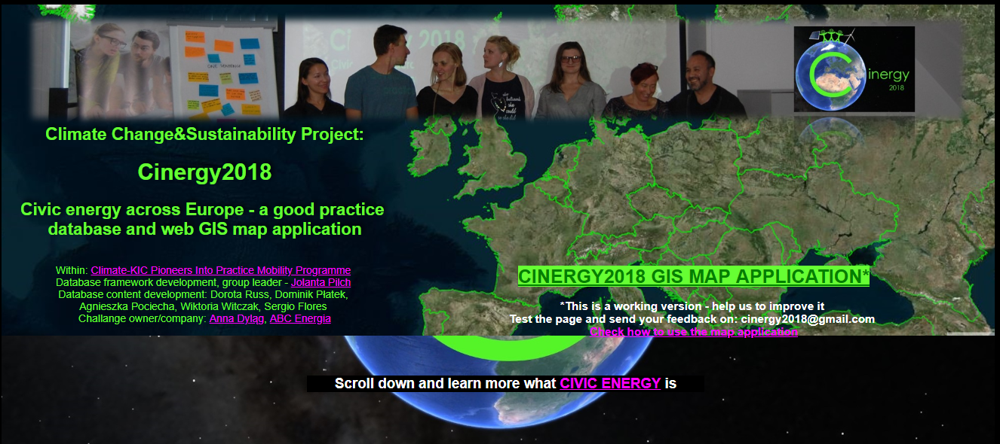
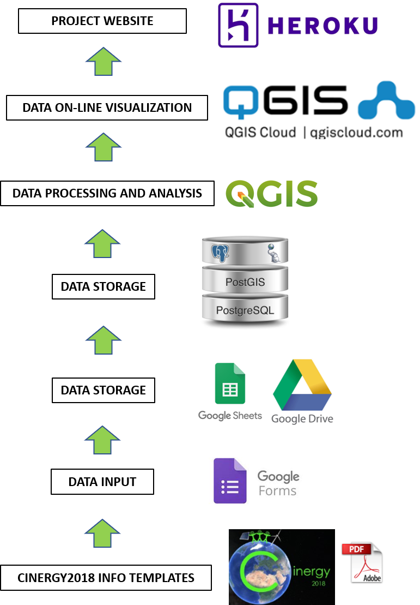
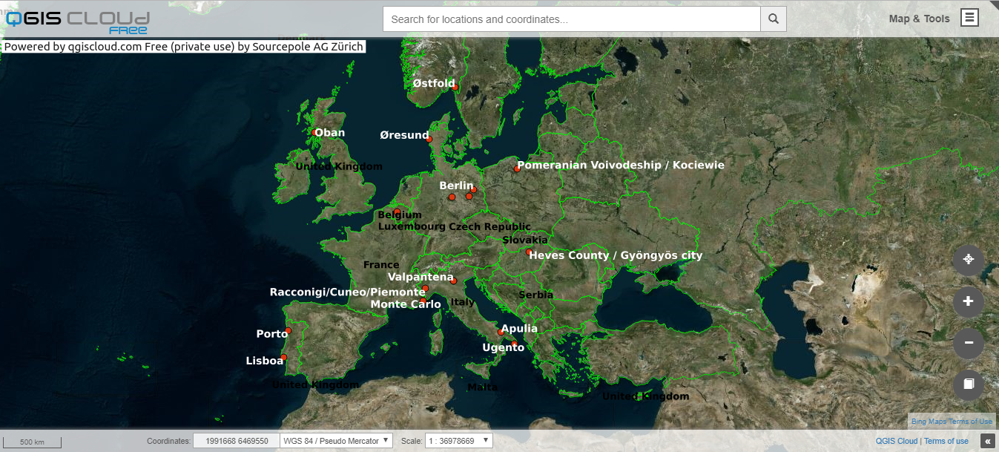
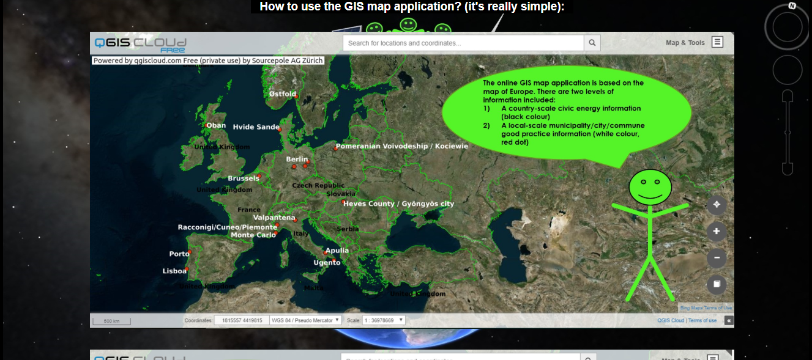

# my website about Cinergy2018 project - database and GIS map

This website is a result of the project Cinergy2018 done within Pioneers into Practice Climate-KIC programme. 
It is a simple static website and contains link to the database and GIS map application on civic energy in Europe.

 

The website is available on:
<h2> https://cinergy2018.herokuapp.com/ </h2> 

## Descritpion and application 

This is a working version of the website, database and GIS map application. Because the project realisation time was very tight I developed 
a temporary framework which I wish to upgrade in the future. 
The current solutions is based on the open-source software and platforms, however, they are not enough integrated to avoid manual 
data manipulation. 

 

<br/>The website html is available in :open_file_folder: Heroku_website/index.html 
<br/>The project PostgreSQL database is available in :open_file_folder: PostgresPostGIS_db/DB_backups/
<br/>The project QGIS project and data is available in :open_file_folder: QGIS_project/Project/Cinergy2018.qgs

 

## Example of code
As this is my really first website it is written with a very basic and simple html and css. 
It will be also improved and optimized with project further project upgrade. 

``` 
<header>
	<div class="title">
		<h2>Climate Change&Sustainability Project:</h2>
		<h1>Cinergy2018</h1>
		<h2>Civic energy across Europe - a good practice 
		</br>database and web GIS map application</h2>
	</div>
	<div class="details">
		<p> Within: 
			<a href="https://pioneers.climate-kic.org/" target="_blank">Climate-KIC Pioneers Into Practice Mobility Programme</a>
			</br>Database framework development, group leader - <a href="#jolacontact">Jolanta Pilch</a> 
			</br>Database content development: Dorota Russ, Dominik Płatek,
			</br>Agnieszka Pociecha, Wiktoria Witczak, Sergio Flores
			</br>Challange owner/company: <a href="https://www.annadylag.pl/">Anna Dyląg</a>, <a href="https://www.abcenergia.pl/">ABC Energia</a>
		</p>
	</div>
	<div class="feedback">
		<h2>
			<a href="https://qgiscloud.com/JolaPilch/Cinergy2018/" target="_blank" class="mapbrowser">CINERGY2018 GIS MAP APPLICATION*</a>
		</h2>
		<h3>*This is a working version - help us to improve it 
		<br/>Test the page and send your feedback on: cinergy2018@gmail.com
		</br ><a href="#instruction">Check how to use the map application</a></h3>
	</div>
</header>

``` 

## Further Documentation 

:closed_book: No detailed documentation exists yet on the project workflow, however, heroku website contains some simple guidelines 
how to use the online GIS map application.



## How can I support developers? 

:+1: Support me with stars, good advice and keep your fingers crossed for my future in IT :smiley: 

## License 

[MIT](LICENSE.txt) license
[GNU](LICENSE.txt) license

## Special thanks 

Special thanks to Climate-KIC organization which enabled me to develop this project :smiley:
